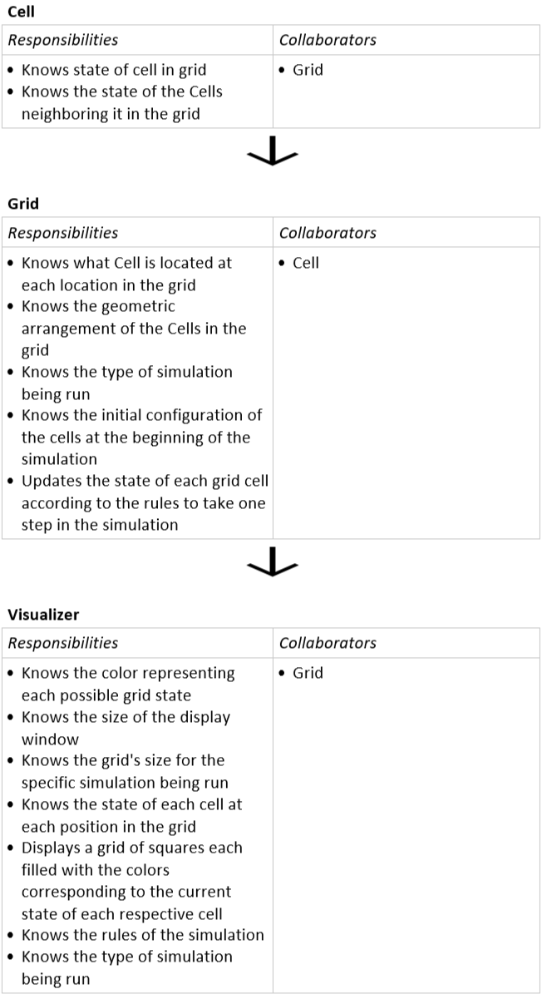

# Simulation Design Plan
### Team Number: 6
### Names
Achilles Dabrowski,
Caleb Sanford,
Cemal Yagcioglu 

## Introduction
The goal of this project is to write a Java program using OpenJFX that animates any 2D CA simulation. The simulation
parameters and starting configuration will be read from an XML file. The structure of our code will be broken up into 
three high-level concepts:
- __The Model:__ This is the backend controller that manages the rules of the simulation and the data associated with
it.
- __The View:__ This controls all of the visualizations created on the screen.
- __The Controller:__ Acts as an interface between the Model and the View. 

The design goals that will govern the three sections of code above are the following:
- __Encapsulation and Open/Closed Principle:__ Using classes to hide the implementation decisions and polymorphism to 
create code that depends on abstractions instead of concrete types.
- __Inheritance and Polymorphism:__ Create abstractions within the code to define general methods that can be 
implemented in multiple ways in separate concrete classes.
- __Developing a GUI program:__ Create a properly structured GUI that responds to user events while 
still maintaining clear separation from the model.

## Overview
### CRC Diagram

* __Cell:__ Instances of the Cell class will keep track of the current state of each grid cell
in the simulation. Each Cell will also have a pointer to each of its neighbors
so that it can check the state of its neighbors to help the program select the appropriate
state for the next step in the simulation based on the simulation's rules. Each
Cell will have public method *char getState()* method to allow to other classes what state the Cell
is in at the current point of the simulation by returning the character that signfies
the current state of the Cell. The public method *int countNeighbors()* will return
the amount of Cells neighboring the Cell in the grid. There will be five child classes of Cell that each
correspond to the five different types of simulations that will be implemented. 
* __Grid:__ Instances of the Grid class will contain a 2D array (or, alternatively,
and ArrayList of ArrayList<Cell>) of Cell objects
corresponding to the locations of the cells in each grid as appropriate for each
step in the simulation. The Grid class will have the public method *char getState(int i, int j)*  
that returns the character signifying the current state of the cell in the ith 
row and jth column of the grid. The Grid class will also have the public method
*void update()* to update each of the Cells in the grid according the rules of the current
simulation to move the simulation forward by one step. There will be five child 
classes of Grid that each correspond to the five different types of simulations 
that will be implemented. In addition, the Grid class will have the public method
*initialize(String configFileDir)* that will create of 2D of Cells in the initial positions
and states specified by the XML file in the directory contained in configFilDir. 
This will called by the Grid's constructor, but can also be called after the simulation
has begun if the user wishes to change the simulation to a new initial state, but 
maintain the same type of simulation as that which was just running. 
* __Visualizer__: Instances of the animator class are responsible for allowing
the user to interact with the user to move the simulation forward at the speed
specified by the user or to the amount of steps forward in time specified by the user. 
The Visualizer class will create an instance of Grid's child class that corresponds
to the type of simulation selected in the GUI, and will pass along the appropriate
XML containing the initial grid configuration to the Grid's constructor. In addition,
the Visualizer will contain public static final Paint variables that contain the appropriate
colors corresponding to each of the possible states of the cells. When the simulation
is initialized or a step is taken, the visualizer will fill the cells of the grid.
The private method *void step(int n)* will move the simulation n steps forward by
calling update() on the Grid object contained for the simulation n times with the help
of a loop. step() will be called when the user clicks the appropriate buttons
on the UI described below to move the simulation forward. The private method 
*void updateDisplay()* will update the color of the cells in the grid displayed in
the window according to the current state of the Cells in the Grid. 

## User Interface
We will create a user interface that follows the basic layout shown below. This will also include a file browser 
allowing the user to graphically choose the XML file to load. Any errors or other messages will be displayed on the 
GUI.

The Buttons will allow the user to:
- start a simulation
- pause and resume the simulation
- load a new simulation
- step the simulation forward in single step increments 
- The animation rate will be selected with a slider

Note: all of the text displayed in the user interface will not be hard coded, it will be set using a View.ViewResources file. This 
will allow button names to be easily adjusted in the future. 
## Design Details & Considerations
* __Grid:__
    Grid is the class responsible for 2D data handling. It is used two initiate and access the ‘grid-like’ data calculated and updated by the controller. Each of its data bits are of Cell Class type. Its instrance variables defines the parameters specific to the grid structure required by the current simulation (for example: grid size).  Grid has also update method that updates the 2D data to the next state, according to the rules Controller method initialized it with. After this update method is run, it is on Visualizer to make use of it for its purposes. 
	
	Grid has 5 subclasses, each dedicated to a specific type of simulation.

    Extra note: update() first copies the 2D data to a temporary variable, and makes use of that variable so that each state is only updated according to the actual step before. 

* __Cell:__
	Cell class is the ’cell’ object of the 2D data in Grid class. It initializes and sets up parameters specific to cell such as its current state. It also has pointers to its neighbors for easy access during simulation calculations. 
	
	Cell has 5 subclasses, each dedicated for a specific type of simulation.

* __Controller:__
	Controller initializes the Grid class according to the rules of the simulation. After it initializing Grid (and Grid initializing Cell), it (or Visualizer, depending on the implementation) call call update() method in Grid class to the next state. (To be more clear on both options, the team discussed whether the simulation should be pre-calculated and 2D data should be stored as 3D data with their respective ’simulation step’ numbers or should the  calculation of the grid should be made on the go during the simulation. In first option updating in controller makes more sense, in the latter updating in the visualizer makes more sense).

* __Visualizer:__:
	Visualizer is the class responsible for using the 2D Grid object along with UI components to output a visually informing interface to the user. It makes use of JavaFx, and visualizes the simulation using cell’s state(and their chosen color) for the given simulation step. If ‘calculation on-the-go’ is implemented as discussed by the group, visualizer calls the update method of Grid objectfor every simulation step iteration and recalls its own updater for updating the visual objects according to the new calcuated grid. It also recognizes if the input file is changed by the user, and automatically updates the grid visual on the screen accordingly (even changing its size if necessary). 

A short discussion about the data structure: Our group shared the idea of using 2D arrays for data manipulation. Yet, to offer a more flexible code, it discussed the option to output that data in iterable form rather than specific its type. This way different methods and classes can choose to implement their own specific collection type of choice to manipulate it. 

#### Use Cases
Use cases: 
* 1-2-3:
1. Visualizer calls Grid update() method 
2. update() copies the current grid to a temporary variable
3. update() iterates through all the Cell Objects, calling Cell.countNeighbors() on each
4. Cell.countNeighbors() returns counts number of live neighbours by making use of its neighbor pointers [This part can be more flexible than described according to the difference between the types of simulation and the teams decision on it during implementation] 
5. Grid updates the temporary 2D grid according to the returned number of cells and the rules of the simulation for Game of Life
6. The Grid's 2D array instance variable is assigned to the temporary array that was created
7. Visualizer calls Visualizer.updateDisplay() after calling the Grid Update, and Visualizer.update uses 2D Grid object and the states of cells within it to create JavaFx visual of it.
 
* 4: XML file is read by the file reader, and the first initialization of Grid Object by Controller class specifically initializes “Fire simulation” type Grid, which initializes Fire Simulation type Cells. During the initialization, probCatch is set as global parameter. 

* 5: Visualizer’s update method checks whether the XML file is changed, it deletes the current objects, calls controller class method for initialization again, which reads XML file, and initializes Grid Object accordingly. 
	

## Team Responsibilities

 * Achilles Dabrowski will be responsible for implementing the Grid class, the
 Cell class, and their subclasses. 

 * Caleb Sanford will be responsible for implementing the Visualizer with a 
 focus on the display GUI.

 * Cemal Yagcioglu will be responsible for the modeller for the 2D data calculation 
 and the updating of Cells.

